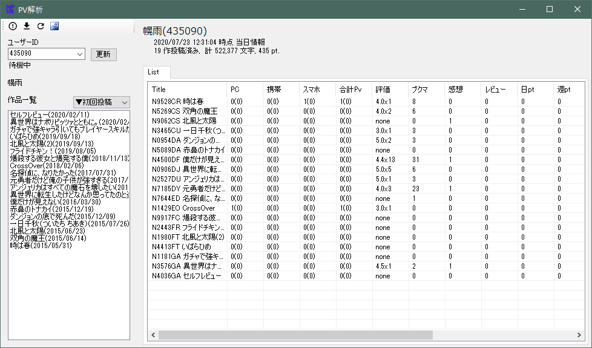
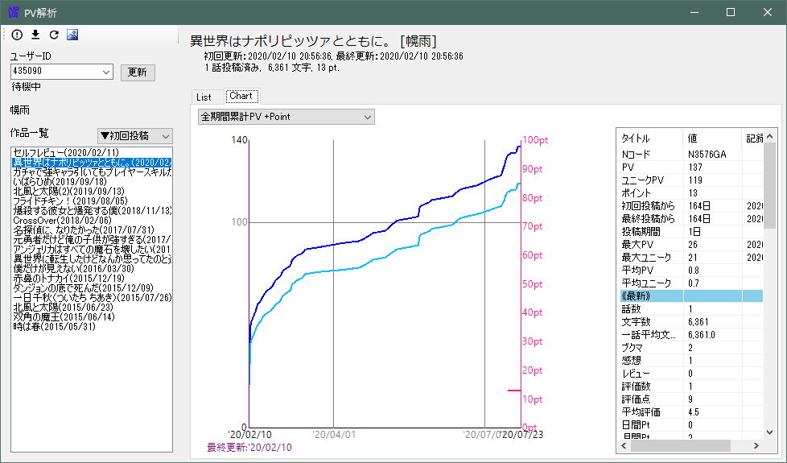

# NPVA
「小説家になろう」のPVや評価数などを分析するためのツールです。

　
　

※「小説家になろう」及び「なろう」は株式会社ヒナプロジェクトの登録商標です。

## 使用方法

### 初回

　「ユーザーID」に自分のユーザーIDを入力し、横の更新ボタンをクリックしてください。
　初回は全作品・全区間のPV情報を取得するため結構時間がかかります。
　ツールバーからログを表示して終わるまで眺めていてください。

　実行する時間帯によっては、PVデータがうまく取得できない場合があります。
　ログに失敗したような情報が表示されていたり、総計のページビューがWebで確認したときの数字と一致していない場合は、ツールバーからPV再取得を実施してみてください。

　この操作はサーバー側に大きな負荷となるため、節度あるご利用をお願いします。

### 毎日

　PV以外の情報、感想数やコメント数、評価点などは毎日取得する必要があるので、がんばって毎日更新します。
　UIからツールバーの更新ボタンをクリックするか、"-update"オプションをつけて起動することでデータを更新できます。

　 "-update"オプション付きでタスクスケジューラに登録し、毎日決まった時間に起動するのがよいでしょう。

### いつでも

　データが日々更新されていれば、基本的にデータの更新は不要です。表示される内容を自由に解釈してください。

　Excel等でデータ分析がしたければ、ツールバーのエクスポートボタンからCSVを出力するのが便利です。

　部位別のPv(ユニークアクセス)の分析機能があります。分析したいタイミングでツールバーから「選択中のタイトルの部位別Pv取得」を選択してください。部位別Pvの取得はAPIがなくKasasagiのスクレイピングによって実施します。  
　データ更新後はチャートの「部位別Pv累計」にデータが表示されるようになるほか、「部位別Pv」タブが選択可能となります。「部位別Pv」タブでは月ごとのヒートマップなどを確認できます。

## 問い合わせ

　本サービスは株式会社ヒナプロジェクトが提供するものではありません。

　このアプリケーション及び作者は「小説家になろう」及び株式会社ヒナプロジェクトとは一切関係ありませんので、そちらへの問い合わせはなさらないようお願いします。

　[Issue](https://github.com/lordhollow/NPVA/issues)やプルリクでいい感じにやってください。

